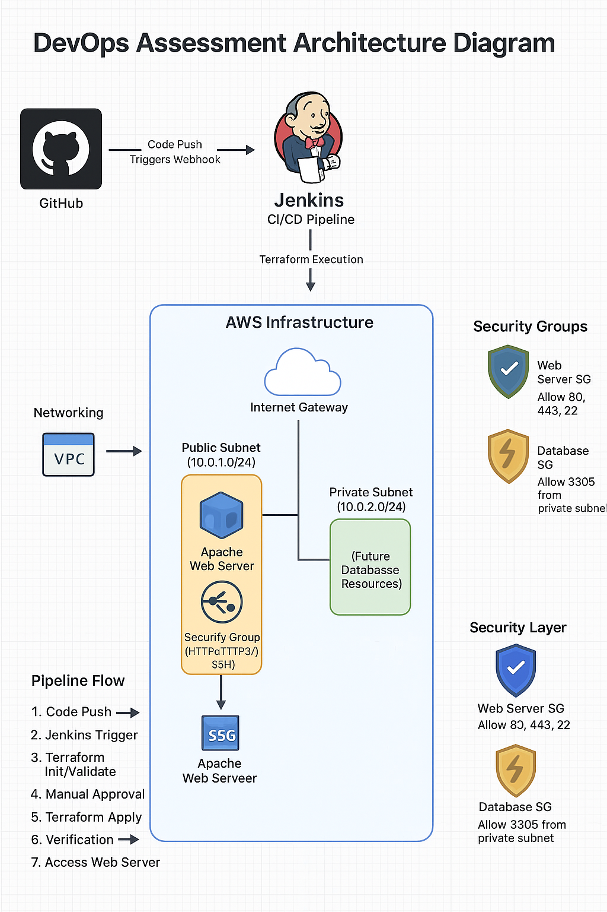

# DevOps Assessment: Automated AWS Deployment Pipeline

## Overview
This project implements an automated CI/CD pipeline for provisioning AWS infrastructure using Terraform, triggered by GitHub commits and managed via Jenkins.

## Architecture

The solution consists of:
- AWS VPC with public and private subnets
- EC2 instance in public subnet running Apache web server
- Security groups with least-privilege access
- Automated CI/CD pipeline using Jenkins

## Prerequisites
- AWS account with IAM credentials
- GitHub account
- Jenkins server
- Terraform installed
- AWS CLI configured

## Setup Instructions
1. Clone this repository
2. Configure AWS credentials in Jenkins
3. Create a Jenkins pipeline using the provided Jenkinsfile
4. Push changes to GitHub to trigger the pipeline

## How to Run
1. Push changes to the main branch to trigger the pipeline
2. Jenkins will:
   - Initialize Terraform
   - Validate configuration
   - Generate execution plan
   - Wait for manual approval
   - Apply changes if approved
   - Verify deployment

## Accessing the Application
After successful deployment, the web application will be available at:
`http://<EC2_PUBLIC_IP>`

The URL will be displayed in the Jenkins pipeline output.

## Cleanup
To destroy all resources:
1. Run `terraform destroy` manually
2. Or create a separate pipeline stage for destruction

## Security Considerations
- AWS credentials are stored securely in Jenkins
- Security groups follow least-privilege principle
- No sensitive data is committed to Git
